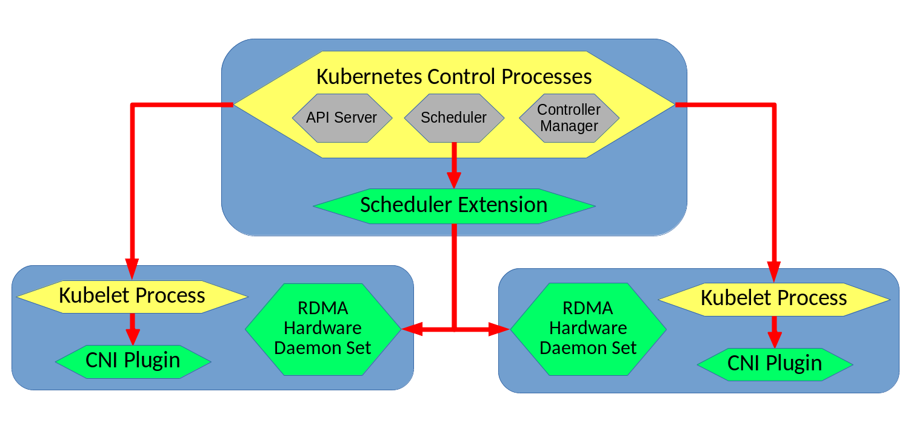

# Introduction

The primary focus of this project was to provide a set of Kubernetes plugins and extensions that would provide the ability to use RDMA interfaces from within Kubernetes containers while also supporting the ability to specify a bandwidth limit or reservation on those containers. Our system builds off of an existing solution from Mellanox Technologies, and seeks to overcome many of the pitfalls and limitations present within that solution. Specifically, our system addresses the lack of synchronization exists between the RDMA Device Plugin and CNI plugin within the previous system, as well as the lack of ability to perform per-pod RDMA interface allocation, among other things.

Our solution replaces the RDMA device plugin with a pair of components: a Kubernetes scheduler extension and an RDMA hardware daemon set. These components work together to allow decisions about which node to deploy pods onto to take available RDMA resources into account, without limiting the amount of detail supported in a pod's specification of its RDMA requirements (as the device plugin interface did for the existing solution).

## Architecture

The main system architecture for our design can be seen below; the green color denotes components that were developed as part of this project, while the yellow color denotes that components are a part of Kubernetes itself:

The main workflow for how a pod would be deployed in our system begins with a request to deploy a pod being sent to the Kubernetes API Server process on the master node of the cluster. As this request is processed by Kubernetes, the Kubernetes scheduler will generate a list of possible nodes that the pod could be placed on, based on some of the requirements of the pods YAML file (excluding RDMA requirements - those will be handled by our scheduler extension) . This list then gets sent to our [Scheduler Extension](components.md#scheduler_extension), which is in charge of deciding which nodes can support the RDMA requirements specified in the pods yaml.

The [Scheduler Extension](components.md#scheduler_extension) contacts each nodes [RDMA Hardware Daemon Set](components.md#rdma_hardware_daemon_set), which return JSON formatted lists of information about their node's RDMA VFs. The [Scheduler Extension](components.md#scheduler_extension) then processes all of the information to determine which nodes can meet the minimum bandwidth requirements of the pod being scheduled. The nodes that can support the pod are added to a list that is sent back to the core Kubernetes scheduler, which makes a final selection from among the nodes in the filtered list. In cases where this list is empty, the pod will remain in the `Pending` state, and Kubernetes will periodically re-attempt to schedule it.

Assuming that the pod was able to scheduled successfully, the Kubelet process on the node it was scheduled to gets called to setup the pod and its containers. During the pods setup process the [CNI Plugin](components.md#cni) is called to configure and attach the RDMA interfaces to the pod. The [CNI Plugin](components.md#cni) first contacts the [RDMA Hardware Daemon Set](components.md#rdma_hardware_daemon_set) on the node that is running to get an up to date list of the state of the node. It then runs the same algorithm that the [Scheduler Extension](components.md#scheduler_extension) had executed previously to determine if a pod's requirements could be satisfied. When used by the CNI plugin, this alogrithm is instead used to determine which RDMA virtual functions to attach to the pod. The [CNI Plugin](components.md#cni) runs atomically within the node it is installed on, meaning no two instances of our RDMA CNI plugin will execute concurrently on the same node. This means that two pods being deployed at the same time will not result in any race conditions in RDMA VF allocation. Once the [CNI Plugin](components.md#cni) completes its work, a response containing the IP addresses allocated to the pod is sent back to the Kubelet process on the same node.

## Limitations

There are a few limitations to keep in mind when using this system:

- Mellanox-centric implementation - The system has not been tested with RDMA hardware from other vendors. While the core design and implementation of each component should not be affected by this, minor adjustments to the CNI Plugin and RDMA Hardware DaemonSet many be necessary to support other vendor's hardware.
- Data Plane Development Kit (DPDK) - The CNI plugin from the existing Mellanox RDMA-in-Kubernetes solution also had support for DPDK. Our forked version of the CNI plugin does not provide the same support (though it may be easy to do so, we have not looked into this)
- Dummy Device Plugin - the current solution requires the use of Device Plugin to allow containerized applications to have privileged access to the `/dev/infiniband` directory. Ideally, this would be possible without the need for an entire device plugin, but discussion on how to do so in Kubernetes is ongoing (See github issues like [this one](https://github.com/kubernetes/kubernetes/issues/5607) and [this one](https://github.com/kubernetes/kubernetes/issues/60748)). To summarize the issue: Docker supports privileged access by a container to a specific directory for the purpose of accessing a hardware device (this is called a "device directory"), but this support is not (yet) exposed by Kubernetes.

## Future Work
- More Vendors - Adding support for RDMA hardware from a wider variety of vendors.
- Migrating CNI - The CNI Plugin currently operates on an older version of the CNI standard, and reformats its responses to fit the newer version. This could be avoided by upgrading the whole plugin to the newer version.
- Scheduling - Implementing more complex algorithms for selecting which node in the cluster a pod gets placed on based on RDMA resources. Similarly, choosing which RDMA VFs are given to which pods by the CNI plugin to achieve the best bandwidth utilization.

#### Our Approach in Short
Problems with Existing Solution:

 - VFs are specified per container.
 - Network plugin only ever gives one VF per pod, this means that the device plugin which tracks the amount of available VFs does not maintain an accurate count of VFs being used.
 - The VFs selected by Kuberentes to be allocated, may not match those actually allocated by the CNI plugin.

Our Solution:

 - Replace RDMA Device Plugin with scheduler extension/RDMA hardware daemon set pairing.
 - Schedular extender queries the RDMA hardware dameon set pod on each node for information about that node's RDMA resources, then filters the list of possible nodes to deploy a pod onto based on resource requirements in the annotations for the pod.
 - CNI Plugin
   - Modify it to handle read pods meta-data
     - Read the amount of VFs
     - Read the bandwidth limitation on each VF
   - Modify plugin to set the bandwidth limits from read metadata
   - Add ability to allocate multiple RDMA interfaces per pod and no RDMA interfaces (for pods that don't request any).
      
